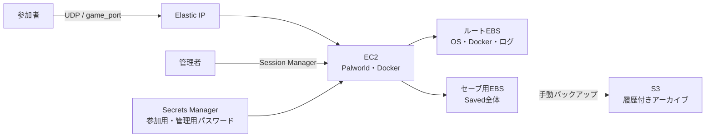

# Palworld private server on AWS

Palworld専用サーバーをAWS上に構築するOpenTofu構成です。

- [作業手順](#作業手順)
- [補足情報](#補足情報)
- [ツールの説明](#ツールの説明)

## 作業手順

### 初回構築

#### 1. 必要なツールを用意する

- AWSアカウントとリソース作成権限を持つ認証情報
- OpenTofu 1.11以降
- AWS CLI

#### 2. 設定ファイルを作る

サンプルをコピーして中身を書き換えます。
```powershell
Copy-Item terraform.tfvars.example terraform.tfvars
```

**参加者のアクセスを許可**:

`allowed_cidrs` に、参加者のグローバルIPv4アドレスをCIDR形式で記載します。

例：
- IPアドレスを個別に許可する場合： `203.0.113.10/32` （ `203.0.113.10` ）
- IPアドレスを範囲指定する場合： `198.18.0.0/16` （ `198.18.0.0` ~ `198.18.255.255` ）
 
参加者のIPアドレスが動的であるなど、ISP登録割り当て範囲で許可したい場合は、後述する [Get-RdapCidr.ps1](#get-rdapcidrps1) を使用すると便利です。

**ポート番号を変更**:

ポート番号を変更する場合は、 `terraform.tfvars` で `game_port` を上書きします。この値はSecurity Group、Dockerのポート公開、Palworldの起動引数、接続先outputへ反映されます。この連動はOpenTofuのテストでも検証しています。

**初回はEC2を作らない**:

初回の `terraform.tfvars` では、サンプルどおり `server_enabled = false` のままにします。先にSecrets Managerを作成してパスワードを登録し、その後EC2を作成します。

#### 3. パスワードの保存先を構築する

```powershell
tofu init
tofu plan -out bootstrap.tfplan
tofu apply bootstrap.tfplan
```

この段階ではSecrets Manager、セーブ用EBS、S3などが作成されます。EC2とElastic IPはまだ作成されません。

#### 4. 初回パスワードを登録する

```powershell
./scripts/Set-PalworldCredentials.ps1
```

画面の指示に従って、参加用パスワードと管理用パスワードを入力します。管理用は参加用とは異なる値にしてください。参加用は12文字以上、管理用は16文字以上が必要です。ダブルクォート、バックスラッシュ、改行は使用できません。

#### 5. ゲームサーバーを構築する

`terraform.tfvars` を変更します。

```hcl
server_enabled = true
```

```powershell
tofu plan -out palworld.tfplan
tofu apply palworld.tfplan
```

#### 6. 初期化の完了を待つ

EC2インスタンスの初回起動では、公式イメージの取得と展開に10分前後かかることがあります。EC2インスタンスにはSession Managerで接続します。

```powershell
aws ssm start-session --target "$(tofu output -raw instance_id)"
```

EC2インスタンス内で `status: done` になるまで待ちます。

```sh
sudo cloud-init status --wait
```

続けてゲームサーバーの状態を確認します。

```sh
sudo systemctl status palworld
sudo docker logs --tail 100 palworld-server
```

ログに次の形式のメッセージがあれば起動完了です。

```text
Running Palworld dedicated server on :<game-port>
```

#### 7. 接続先を確認する

Session Managerを終了し、PC上で以下を実行します。

```powershell
tofu output server_address
```

表示された `IPアドレス:ポート番号` をPalworldの接続先として共有します。接続には構築時に指定した参加用パスワードが必要です。

### 運用

パスワードはOpenTofuの管理対象ではないため、通常の `tofu plan` または `tofu apply` ではパスワードの入力は不要です。

```powershell
tofu plan -out palworld.tfplan
tofu apply palworld.tfplan
```

#### a. 状態とログを確認する

```sh
sudo systemctl status palworld
sudo docker logs --tail 100 palworld-server
```

#### b. ゲーム設定を変更する

設定ファイルはセーブデータと同じ永続EBS上にあります。EC2再作成時に残るものは [構成と永続化](#構成と永続化) を参照してください。

```text
/srv/palworld/Saved/Config/LinuxServer/PalWorldSettings.ini
```

サーバーを停止してから編集してください。

```sh
sudo systemctl stop palworld
sudo vi /srv/palworld/Saved/Config/LinuxServer/PalWorldSettings.ini
sudo systemctl start palworld
```

#### c. 手動バックアップを取得する

```sh
sudo /usr/local/sbin/backup-palworld
```

バックアップ中はゲームサーバーが一時的に停止するため、参加者がいないことを確認してから実行してください。手動で停止する必要はなく、このスクリプト自身が停止、S3への送信、再開を順番に実行します。失敗時も再開を試み、実行前から停止していた場合は停止したままにします。

#### d. バックアップをローカルPCへエクスポートする

```powershell
$bucket = tofu output -raw backup_bucket
aws s3 ls "s3://$bucket/backups/"
aws s3 cp "s3://$bucket/backups/<archive-name>.tar.gz" .
```

#### e. パスワードを変更する

参加者がいないことを確認してから、初回登録と同じスクリプトを実行します。

```powershell
./scripts/Set-PalworldCredentials.ps1
```

スクリプトはSecrets Managerへ新しい値を登録し、EC2が存在する場合はSystems Manager経由でPalworldを再起動して反映します。EC2の再作成や `tofu apply` は不要です。サーバーを撤去中の場合はSecrets Managerだけを更新し、次回起動時に反映します。

#### f. 公式イメージを更新する

更新前に手動バックアップを取得します。公式イメージの新しい固定タグを確認し、 `palworld_image` を変更して適用します。

```powershell
tofu plan -out image-update.tfplan
tofu apply image-update.tfplan
```

EC2は再作成されますが、セーブ用EBSは保持されます。

#### g. EC2を撤去してセーブを残す

遊ばない期間は `terraform.tfvars` の値を変更します。

```hcl
server_enabled = false
```

```powershell
tofu plan -out stop.tfplan
tofu apply stop.tfplan
```

EC2とElastic IPは削除されます。セーブ用EBS、Secrets Manager、S3バックアップは残ります。

再開するときは `server_enabled = true` に戻して適用します。Elastic IPは作り直されるため、ゲームサーバーのIPアドレスは変わる可能性があります。

## 補足情報

### 構成と永続化



| 用途 | AWSリソース・設定 |
| --- | --- |
| ゲームサーバー | Amazon Linux 2023 x86_64、EC2 `r7i.xlarge` （4 vCPU / 32 GiB RAM） |
| OSとDocker | 暗号化gp3ルートボリューム、既定 50 GiB |
| セーブデータ | 暗号化gp3 EBS、既定 100 GiB |
| バックアップ | 非公開・暗号化・バージョニング有効のS3バケット |
| パスワード | AWS Secrets Manager |
| 管理接続 | AWS Systems Manager Session Manager、SSHポートなし |
| ゲーム通信 | `allowed_cidrs` から `game_port` へのUDP通信のみ |

公式要件は4コア、16 GB RAM、安定動作向けには32 GB以上、高速SSD、64-bit Linuxです。この構成は安定動作向けの32 GiBを採用しています。

| 保存場所 | 保存するもの | EC2再作成・撤去時 |
| --- | --- | --- |
| EC2ルートEBS | OS、Docker、コンテナイメージ、systemd定義、コンテナログ | EC2と一緒に削除。新しいEC2のcloud-initが再作成 |
| セーブ用EBS | `/srv/palworld/Saved` 全体。ワールド、プレイヤー、ゲーム設定 | EC2から独立して保持し、新しいEC2へ再接続 |
| S3 | 手動で作成した `Saved` の圧縮アーカイブと旧バージョン | EC2から独立して保持 |
| Secrets Manager | 参加用パスワードと管理用パスワード | EC2から独立して保持 |

EC2だけにあるログやコンテナイメージは消えますが、ゲームの再開に必要な `Saved` 全体はセーブ用EBSに残ります。EBS自体の障害や誤操作にも備えるため、S3バックアップも併用します。

### パスワードの扱い

OpenTofuはSecrets Managerの入れ物とEC2から読み取る権限だけを管理し、パスワードそのものは管理しません。そのため、パスワードはOpenTofuの設定、plan、state、EC2のuser dataに保存されることはありません。

`Set-PalworldCredentials.ps1` は対話入力した値をSecrets Managerへ登録します。AWS CLIへ渡すために一時JSONファイルを作成しますが、処理の成否にかかわらず最後に削除します。EC2はPalworldの起動時にSecrets Managerから現在の値を取得し、ゲーム設定へ反映します。

- `ServerPassword` はゲーム参加時のパスワードです。
- `AdminPassword` はゲーム内で管理者権限を取得するための別パスワードです。

### セーブデータとバックアップ

セーブデータはEC2のルートディスクではなく、独立したEBSへ保存されます。EC2を再作成または撤去してもEBSは残ります。

定時バックアップは設定していません。プレイ終了後など、ゲームサーバーを一時停止しても問題ないタイミングで手動バックアップを実行してください。定時実行が必要な場合は、利用時間に合わせてsystemd timerなどを各自で設定してください。

バックアップは `Saved` 全体をS3の `backups/` 以下へ保存します。アーカイブにはゲーム設定やパスワードも含まれ得るため、公開しないでください。

EBSとS3バケットには `prevent_destroy` を設定しています。そのため通常の `tofu destroy` は、セーブデータの誤削除を防ぐため意図的に失敗します。完全に削除するときだけ、先にエクスポートしたうえで保護設定を外してください。

### 接続元CIDR

AWS Security GroupはISP名やASNを直接指定できません。IPv4 CIDR、IPv6 CIDR、Security Group、Prefix Listのいずれかを指定します。この構成ではIPv4 CIDRを使用します。

- `/32` は現在のIPv4アドレス1個だけを許可します。
- RDAPの登録割り当て範囲は動的IPアドレスの変更に追従しやすくなりますが、同じ範囲のほかの利用者もポートへ到達できます。
- `0.0.0.0/0` はインターネット全体から到達できるため推奨しません。

RDAPで得た登録範囲は、次回も同じ範囲から割り当てられる保証ではありません。接続できなくなった場合は、新しいIPv4アドレスで再確認してください。

### 初回構築とOpenTofuの完了タイミング

`tofu apply` の完了はAWSリソースの作成完了を示します。EC2内のDockerインストール、公式イメージ展開、systemdユニット作成は、その後もcloud-initで続きます。

初期化中は `docker images` が空で、 `palworld.service` がまだ存在しないことがあります。 `sudo cloud-init status --wait` が完了するまで待ってから確認してください。

### 概算費用

2026-07-26時点、東京リージョンで、利用時だけ `server_enabled = true` にする運用の概算です。実際の請求は利用時間、データ量、為替、税、AWSの料金改定で変わります。

EC2の有無にかかわらず、セーブデータなどを保持するために発生する固定費用です。

| 固定費用 | 単価と条件 | 1か月当たり |
| --- | --- | ---: |
| セーブ用gp3 EBS | 100 GiB、 `0.096 USD/GB月` | 9.60 USD |
| Secrets Manager | シークレット1個 | 0.40 USD＋API呼び出し料 |
| S3 Standard | バックアップの保存量、 `0.025 USD/GB月` | 保存量に応じる |
| 固定費用の合計 | S3、API呼び出し、税を除く | 約10.00 USD/月 |

`server_enabled = true` の間だけ追加で発生する変動費用です。ルートEBSの月額単価は730時間で割って時間単価へ換算しています。

| 変動費用 | 単価と条件 | 稼働1時間当たり |
| --- | --- | ---: |
| EC2 `r7i.xlarge` | Linuxオンデマンド | 0.3192 USD |
| ルートgp3 EBS | 50 GiB | 約0.0066 USD |
| パブリックIPv4 | 1個 | 0.0050 USD |
| 変動費用の合計 | 通信、税を除く | 約0.3308 USD/時間 |

したがって、S3や通信などを除く月額概算は `10.00 USD＋0.3308 USD×サーバー稼働時間` です。1 USDを160円と仮定すると、固定費用は約1,600円/月、変動費用は約53円/時間です。S3のリクエスト料金とデータ転送料は別途かかります。

### OpenTofuのstate

OpenTofuのstateは紛失しない場所で管理してください。チーム運用では、既存の管理用S3バケットを使うリモートbackendへの移行を推奨します。

以前の構成でパスワード値をOpenTofu管理にしていたstateでは、最初の `tofu apply` で `aws_secretsmanager_secret_version.palworld` がstateから除外されます。 `removed` blockによりAWS上の現在値は削除されません。

この移行ではEC2のuser dataも変わるため、既存のEC2は一度だけ再作成されます。参加者がいないことを確認して手動バックアップを取得してから適用してください。以後のパスワード変更ではEC2は再作成されません。

### 参照

- [Palworld Server Guide:要件](https://docs.palworldgame.com/ja/getting-started/requirements/)
- [公式DockerイメージとComposeサンプル](https://github.com/pocketpairjp/palworld-dedicated-server-docker)
- [Amazon EC2オンデマンド料金](https://aws.amazon.com/jp/ec2/pricing/on-demand/)
- [Amazon EBS料金](https://aws.amazon.com/jp/ebs/pricing/)
- [Amazon VPC料金](https://aws.amazon.com/jp/vpc/pricing/)
- [AWS Secrets Manager料金](https://aws.amazon.com/jp/secrets-manager/pricing/)
- [Amazon S3料金](https://aws.amazon.com/jp/s3/pricing/)

## ツールの説明

### Set-PalworldCredentials.ps1

参加用・管理用パスワードを対話形式で受け取り、Secrets Managerへ新しいバージョンとして登録するPowerShellスクリプトです。引数を省略すると、現在のOpenTofuのstateからシークレットARNを取得します。

```powershell
./scripts/Set-PalworldCredentials.ps1
```

EC2を撤去中に初回登録または変更した場合の出力例:

```text
参加用パスワード: ************
管理用パスワード: ****************
Updated the Palworld credentials in Secrets Manager.
No running Palworld EC2 instance was found. The credentials will be applied when the server starts.
```

EC2の稼働中に変更した場合は、Systems Manager経由でPalworldを再起動します。

```text
Updated the Palworld credentials in Secrets Manager.
Restarted the Palworld service through Systems Manager.
```

シークレットだけを更新して再起動を後回しにする場合は `-SkipRestart` を指定します。次回のPalworld起動時に新しい値が反映されます。

```powershell
./scripts/Set-PalworldCredentials.ps1 -SkipRestart
```

別のシークレットを更新する場合は、ARNを位置引数で指定できます。

```powershell
./scripts/Set-PalworldCredentials.ps1 'arn:aws:secretsmanager:ap-northeast-1:123456789012:secret:example'
```

### Get-RdapCidr.ps1

指定したIPv4アドレスをRDAPで照会し、登録割り当て範囲をCIDRとして表示するPowerShellスクリプトです。

複数のIPv4アドレスを位置引数で指定できます。

```powershell
./scripts/Get-RdapCidr.ps1 '8.8.8.8' '1.1.1.1'
```

実際に `8.8.8.8` を照会した出力例:

```text
IpAddress    : 8.8.8.8
NetworkName  : GOGL
StartAddress : 8.8.8.0
EndAddress   : 8.8.8.255
Cidr         : 8.8.8.0/24
AddressCount : 256
Source       : https://rdap.arin.net/registry/ip/8.8.8.0
```

`-Tofu` を指定すると、 `terraform.tfvars` へ貼り付けられる形式になります。同じ登録範囲は重複排除されます。

```powershell
./scripts/Get-RdapCidr.ps1 '8.8.8.8' -Tofu
```

実際の出力例:

```hcl
allowed_cidrs = [
  "8.8.8.0/24",
]
```

プライベートIPv4アドレスや不正な入力はエラーになります。表示されるCIDRは登録割り当て範囲であり、ISPの全契約者を完全に網羅するものではありません。
